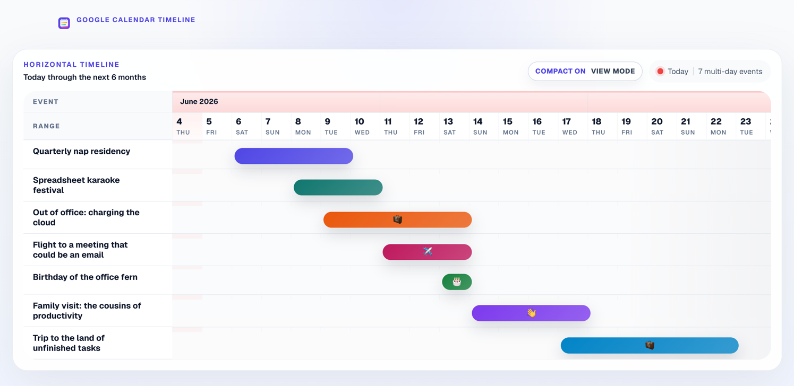
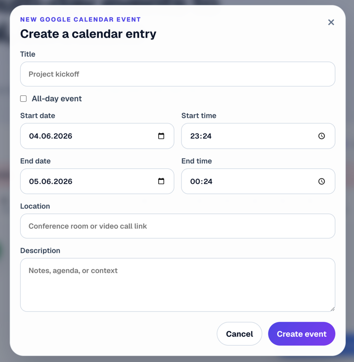
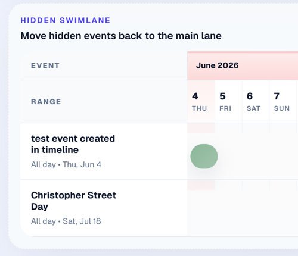

# Google Timeline

Google Timeline turns Google Calendar into a clean horizontal timeline for long-running events. It highlights multi-day spans across the next six months, keeps the layout compact, and lets you create events without leaving the page.

## Screenshots

### Main timeline



### Quick event creation



### Hidden swimlane



## Features

- **Six-month horizontal timeline** for upcoming calendar spans
- **Multi-day and all-day focus** with single-day timed noise removed
- **Compact mode** for denser vertical scanning
- **Hidden swimlane** to temporarily move noisy events out of the main view
- **Quick event creation** with Google Calendar write support
- **Google OAuth sign-in** via NextAuth
- **Demo mode** for local preview without live Google Calendar data
- **Landing page, privacy policy, and terms pages** for deployment-ready presentation

## Tech stack

- Next.js 16 App Router
- React 19
- TypeScript
- NextAuth v4
- Google Calendar API
- SWR
- CSS Modules

## Getting started

### 1. Install dependencies

```bash
npm install
```

### 2. Configure environment variables

Copy the example file:

```bash
cp .env.example .env.local
```

Then fill in the required values.

| Variable | Required | Description |
| --- | --- | --- |
| `GOOGLE_CLIENT_ID` | For Google mode | Google OAuth client ID |
| `GOOGLE_CLIENT_SECRET` | For Google mode | Google OAuth client secret |
| `GOOGLE_CALENDAR_ID` | Optional | Default calendar ID to read/write and map to the `/default` route, defaults to `primary` |
| `DEMO_MODE` | Optional | Set to `true` to use sample data instead of Google Calendar |
| `NEXTAUTH_SECRET` | Yes | Secret used by NextAuth |
| `NEXTAUTH_URL` | Yes | Base app URL, for example `http://localhost:3000` |

If you use Google OAuth locally, configure the callback URL in Google Cloud as:

```text
http://localhost:3000/api/auth/callback/google
```

### 3. Start the app

```bash
npm run dev
```

Open [http://localhost:3000](http://localhost:3000).

## Scripts

```bash
npm run dev    # start local development server
npm run lint   # run ESLint
npm run build  # production build + type-check
npm run start  # start the production server
```

There is currently no dedicated test suite configured in this repository.

## How it works

- `src/app/page.tsx` serves the landing page and redirects signed-in users to the default calendar route.
- `src/app/[calendar]/page.tsx` renders the selected calendar tab, authenticated app view, and error states.
- `src/lib/calendar.ts` fetches the available Google calendars plus events, exposes demo-mode sample data, and normalizes calendar entries into timeline-ready rows and date columns.
- `src/components/calendar-board.tsx` manages client-side state like compact mode, hidden events, and SWR data refresh.
- `src/components/calendar-timeline.tsx` renders the timeline grid, bars, hover details, and toolbar controls.
- `src/app/api/calendar/events/route.ts` reads and mutates events for the currently selected calendar tab.
- `src/auth.ts` configures Google OAuth, JWT sessions, and token refresh behavior.

## Behavior notes

- The UI emphasizes **multi-day spans**.
- **Single-day timed events are intentionally filtered out** from the timeline.
- **All-day events stay visible**, even when they span only one day.
- In demo mode, the app returns sample overlapping events and does not require Google sign-in.
- Calendar tabs are fetched from the Google Calendar API `calendarList.list` endpoint when signed in.

## Deployment

This project is designed to work well on Vercel, but it can run anywhere that supports Next.js. Make sure your production environment includes the same OAuth and NextAuth environment variables as local development.

## License

Add a license file if you want to make usage terms explicit for the codebase itself.
